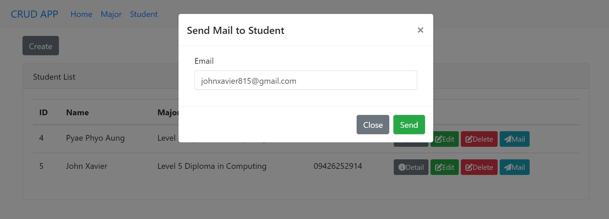
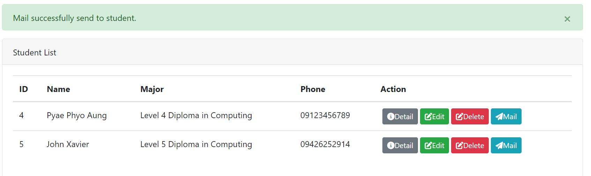

<h3>Laravel Assignment_05</h3>

This is laravel send mail project by using Laravel version 8 and axios.

<ul>
    <li>
        Clone your project
    </li>
    <li>
        Go to the folder application using cd command on your cmd or terminal
    </li>
    <li>
        Run composer install on your cmd or terminal
    </li>
    <li>
        Copy .env.example file to .env on the root folder.
    </li>
    <li>
        You can type copy .env.example .env if using command prompt Windows or cp .env.example .env if using terminal, Ubuntu
    </li>
    <li>
        Open your .env file and change the database name (DB_DATABASE) to whatever you have, username (DB_USERNAME) and password (DB_PASSWORD) field correspond to your configuration.
    </li>
     <li>
       Download fontawsome and add folder in the public folder.
    </li>
    <li>
        Run php artisan key:generate
    </li>
    <li>
        Run php artisan migrate
    </li>
    <li>
        Run php artisan serve
    </li>
    <li>
        Go to http://localhost:8000/
    </li>
</ul>

<h4>Preview</h4>
<h5>Send mail</h5>

<h5>Send Mail Succeess</h5>

<h5>Mail Error</h5>

