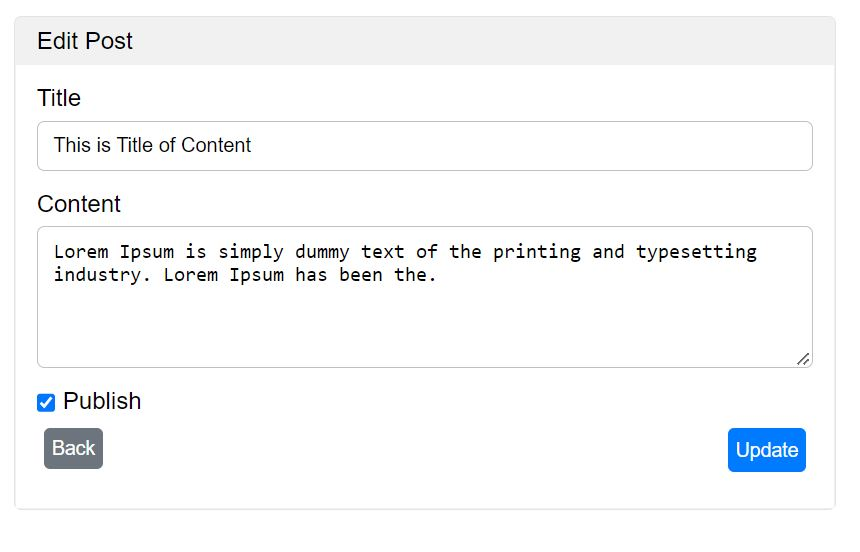

<h3>Tutorial 8</h3>

You can upload your post with post title and content.

Post title cannot be empty.

You can also update and delete post.

You need to import database form database folder and name the database as tutorial_08

<h4>Preview</h4>
<h5>Home</h5>

<h5>Create</h5>

<h5>View</5>

<h5>Update</h5>

<h5>Delete</5>

