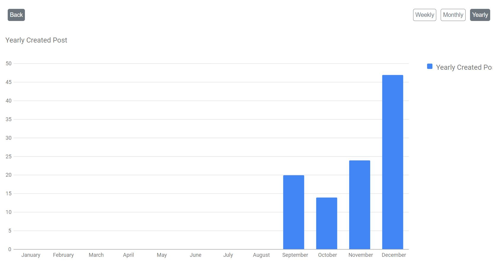
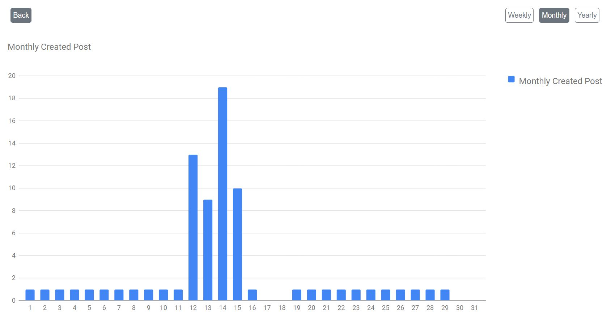
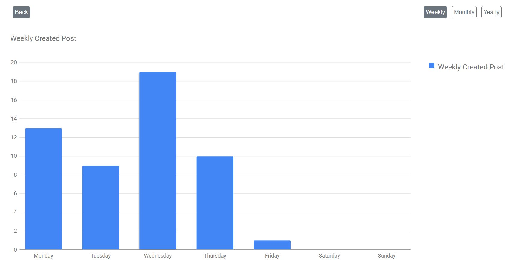

<h3>Tutorial 9</h3>

You need to import database form database folder and name the database as tutorial_08.

There is also seeder file but the best way is to import table to your database.

You can see created posts by weekly, monthly and yearly in bar chart.

<h4>Preview</4>
<h5>Yearly Graph</h5>

<h5>Monthly Graph</h5>

<h5>Weekly Graph</h5>

