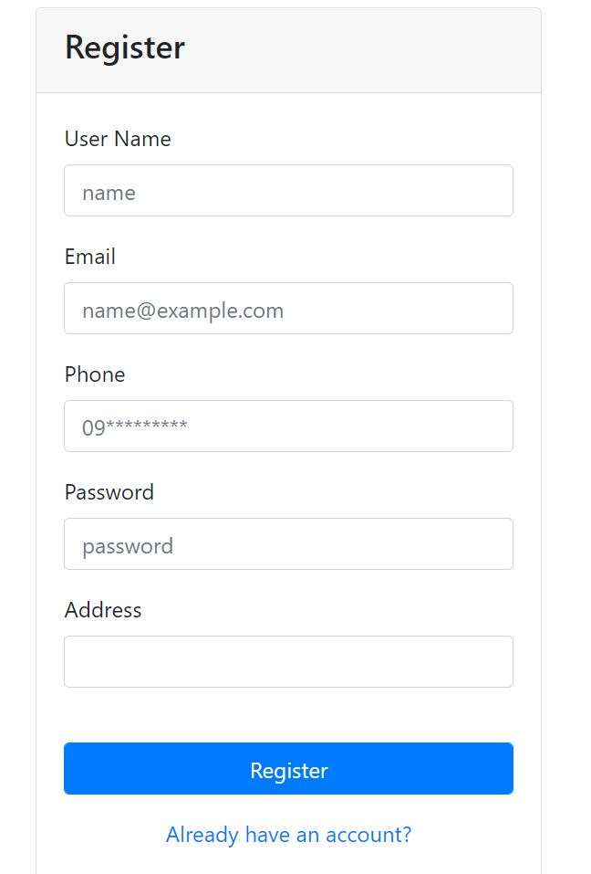
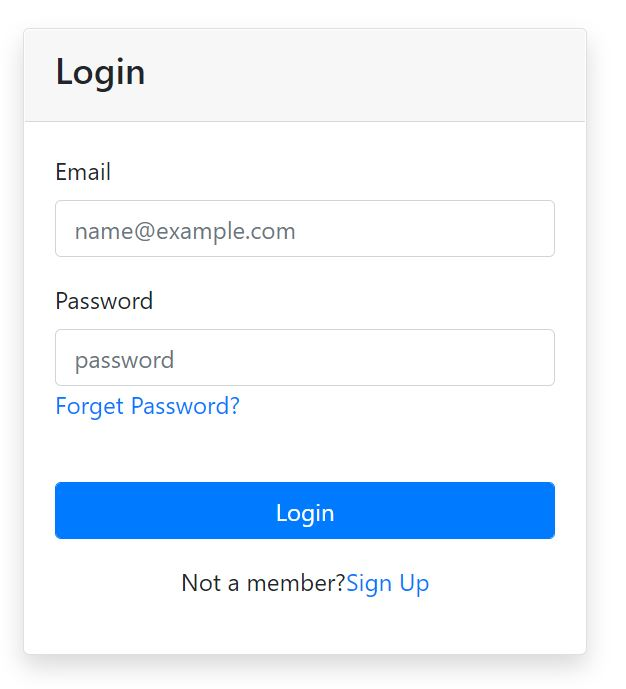
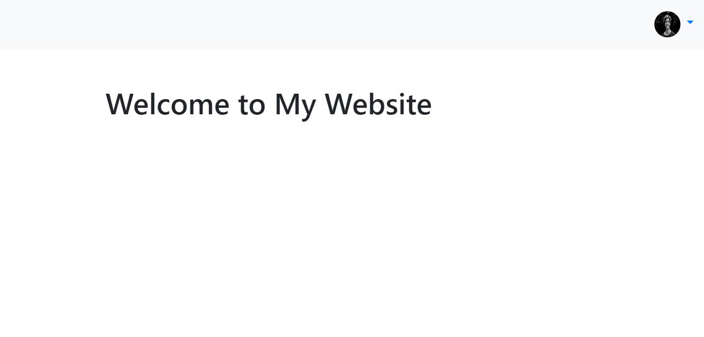
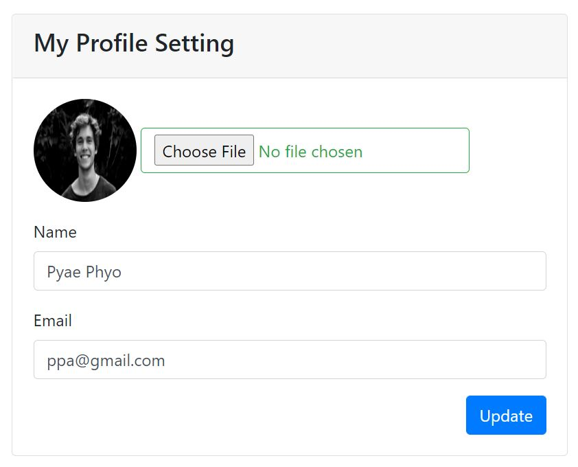
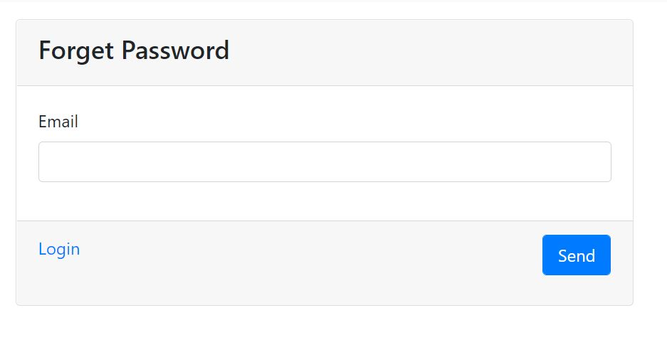
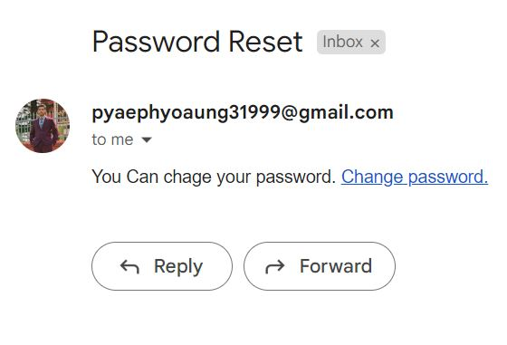
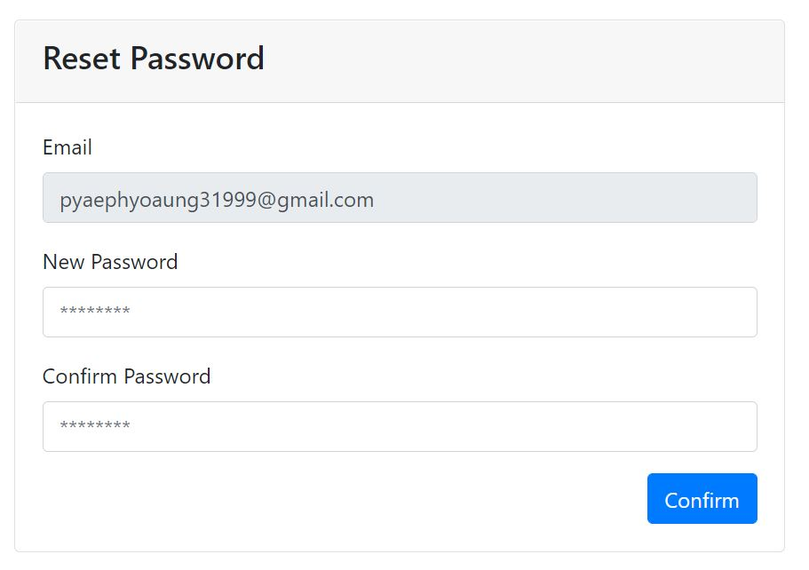

<h3>Tutorial 10</h3>

In this system you can create your own account and can manage your account.

To run this project you need to create database in your pc and name tutorial_10.

Second stept is run database.php in your browser.

 After all those process, you can use the system.

<h4>Preview</h4>
<h5>Register Page</h5>

<h5>Login Page</h5>

<h5>Dashboard Page</h5>

<h5>Profile Page</h5>

<h5>Forget Password</h5>

<h5>Reset Password Email</h5>

<h5>Reset Password</h5>

